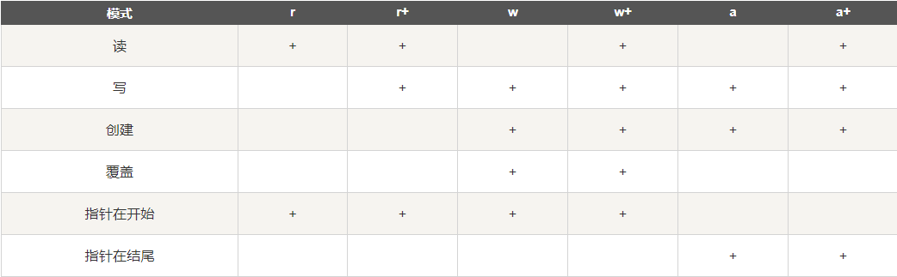

# pythonLearn
python学习随堂代码


## 基本语法
1. 在python中严格区分大小写
2. 在python中的每一行就是一条语句，以换行符为结尾，所以不需要分号(;)
3. 每一行语句的长度不要过长（规范中建议每行不超过80个字符）
4. 语句跨行时，在语句后面使用 “ \ ”结尾，就可以进行换行，相当于同一语句
5. python是缩进严格的语言，不要随意使用缩进和空格、
6. python中使用 " # " 表示注释

## 字面量（常量）和变量

## 变量和标识符
python中的变量**不需要声明**，直接用。  
但是不能使用未被赋值的变量，为赋值的变量相当于没声明。  
python的变量是动态的，变量的类型会随最后一次赋值的变量类型改变。  
如 直接  a = 10  
        print(a)  
    这是允许的  
   
### 标识符的规范 
1. 标识符可以含有：字符、数字、_、但是不能数字开头。
2. 标识符不能使python的关键字和保留字。
3. 别使用python的函数名作为变量名，因为函数名会被覆盖成新的数据类型及数据，不再是一个函数。
4. 下划线命名法：所有字母小写，单词之间使用_分割。

## 数值
在python中分成了三种：**整数、浮点数（小数）、复数**  

### 整数
在python中所有的整数都是int类型，而且没有大小限制，可以是一个无限大的整数。
> 如果数字的长度过大，可以使用下划线作为分隔符。
> 如： c = 123_456  与  c = 123456 等效  

其他进制的数，只要是数字打印时一定以十进制的形式显示。（二进制0b开头；八进制0o开头；十六进制0x开头）  
### 浮点数
在python中浮点数都是float类型，没有double类型。
## 字符串
在python中字符串需要使用引号括起来（单引号、双引号都可以，成对使用）  
> 但是相同的引号不能嵌套
```python
# 嵌套需要不同的引号嵌套，这两种情况是运行的。
print(" 子曰：'学而时习之'  ")
print(' 子曰："学而时习之"  ')
```
> 单引号和双引号不能跨行使用，
```
# 这是会报错的

'学而时习之不亦说乎，
有朋自远方来不亦君子乎。'

# 这样不会报错，但是只能单行显示，不会自动换行

'学而时习之不亦说乎，\
有朋自远方来不亦君子乎。'
```
解决该问题，可以使用长字符串
> 使用三重引号来表示一个长字符串'''  或者  """ 
> 长字符串可以跨行，并且保留字符串中的格式
```python
"""学而时习之不亦说乎，
有朋自远方来不亦君子乎。"""
```
### 转义字符 （\）
```python
# 在 " 前面 加\ 表示转义
print(" 子曰：\"学而时习之\"  ")
```
\" 表示 "  
\' 表示 '  
\t 表示制表符  
\n 表示换行符  
\\ 表示反斜杠 \  
\uxxx 表示Unicode编码  
### 格式化字符串 
```python
#这种写法在python中不常见
a = 'Hello'
print('a = ' + a)
```
> **python中字符串不能与其他类型数据进行加法（+）运算！！**

解决办法：
1. 使用函数参数：  
print（'str1 ='，int）  ==>>   str1 = int  
2. 使用占位符  
print（'str2 = %s' % 'int'）   ==>>   str1 = int  
    - %s 在字符串中表示任意字符
    - %f 浮点数占位符
    - %d 整数占位符  
    ```python
       # 字符串占位
       b = '%s 师父被妖怪抓走了' % '大师兄' 
       b = '%s 师父%s被妖怪抓走了' % ('大大师兄', '又')
       # %3.4s 表示字符串长度限制在3-4之间，少了在前面补空格，多了将后面截掉
       b = '%3.4s 师父%.1s被妖怪抓走了' % ('大师兄兄兄', '又又')
       
           # 整数占位
       c = '您的余额为：%d' % 123.998   # 输出为'您的余额为：%d' % 123' ,即舍弃小数
       
       # 浮点占位 保留3位小数，自动四舍五入
       d = '您的余额为：%.3f' % 123.998
    ```
3. 格式化字符串  
是python中新加的。可以通过子啊字符串前添加一个F或者f(不能有空格)来创建一个格式化字符串    
在格式化字符串中可以直接嵌入变量
    ```python
   a = '师父'
   b = '被妖怪抓走了'
   c = f'大师兄,{a}{b}'
   print(c)  # 输出：大师兄,师父被妖怪抓走了
   print(f'c = {c}') # 输出： c = 大师兄,师父被妖怪抓走了
    ```
4. 复制字符串（将字符串与数字相乘）
    ```python
   a = 'abc'
   # python中特有的，将字符串与数字相乘，则解释器会将字符串重复指定次数并返回
   a = a * 3
   print('a = {a}')    # 输出： a = abcabcabc
    ```
## 布尔值（bool）
python中布尔值可以用0和1代替。可与整数进行计算。(True/False)
## 空值（None)
## 类型检查  
可以检查变量的类型  
```python
print(type(1))  # <class 'int'>
print(type(1.2))  # <class 'float'>
print(type('hello'))  # <class 'str'>
print(type(True))  # <class 'bool'>
print(type(None))  # <class 'NoneType'>
```
## 对象 
* 每个对象中都要保存三种数据
    - id（标识）  
    可以使用id（）函数来查看对象的id，id是由解析器生成的，在CPython中，id就是对象的内存地址。  
    - type（类型）  
    通过type（）函数查看对象类型
    - value（值）
## 变量和对象
变量存储的值，实际是对象的物理地址（id）。
## 类型转换
python对象是强类型对象，不能更改类型。  
类型转换实际上是参照原对象的值创建一个指定类型的新对象，并将新对象作为返回值。  
类型转换四个函数：int()  float()  bool()  str()  
字符串转成整型，需要字符串就是一个整型样式，即123.
0 、 None 、 '' 转换成bool会是False，其余都是True  
## 运算
- // 整除，向下取整。  ex. -5 // 2 = -3    5 // 2 = 2   
- ** 幂运算，求一个值的几次幂。 0.5 表示开根号，2表示平方    
- % 取模（余数）  
- 对字符串进行关系运算时，是**逐位**比较其Unicode编码。  
- ==  和 != 比较的是值是否相等  
- is  和  is not  比较id是否相等，即是不是同一个对象。  
- 三元运算不是?:在python中使用：
    ```
  语句1 if 条件表达式 else 语句2 
  
  # 条件表达式为True，执行语句1.
    ``` 
 ## 序列
* 可变序列  
    * 列表（list)
* 不可变序列  
    * 字符串(str)
    * 元组（tuple）
## 列表
```python
# 下标从 0 开始
my_list = [1,2,3,'hello']
# 数组是循环的，my_list[-1] == 'hello' 

# 使用 len（） 函数输出容器长度
len(my_list)
```
### python 中支持 切片
```python
# list = [起始:结束:步长]
# 切片表示在 起始与结束索引前面都进行隔开 中间的区域形成新数组

my_list = [1,2,3,'hello']
cut_list1 = my_list[0:1]  #  cut_list1 = [1]
cut_list2 = my_list[1:]   #  cut_list2 = [2,3,'hello']

# 步长是每次获取元素的间隔，可以是负数，-1代表倒序
cut_list3 = my_list[0::2] #  cut_list3 = [1,3]
cut_list4 = my_list[0::-1] # my_list = ['hello',3,2,1]
```
# 函数
## input()函数
该函数用来获取用户的输入，有阻塞作用。  
用户输入的内容会作为**字符串**类型作为返回值  
input()的参数会作为提示文字显示。  
```python
username = input('请输入用户名:')
print(username)
```
## if流程控制
**代码块以缩进<tab>为开始，直到恢复上一级缩进时结束。**  
python官方文档中推荐使用空格（4个）进行缩进
```
# if条件控制语法：
    if 条件表达式 : 语句  
# 或者
    if 条件表达式 :
    <tab>语句1
    <tab>语句2
    else if 条件表达式 :
    <tab>语句3
    <tab>语句4
    else :
    <tab>语句5
    <tab>语句6
```    
## while循环
语法：
```
while 条件表达式 :
<tab>语句1
else :
<tab>语句2
```
## break 和 continue
break 直接跳出循环（包括else）  
continue 跳出当次循环

## 迭代器与生成器
* 迭代是Python最强大的功能之一，是访问集合元素的一种方式。
* 迭代器是一个可以记住遍历的位置的对象。
* 迭代器对象从集合的第一个元素开始访问，直到所有的元素被访问完结束。迭代器只能往前不会后退。
* 迭代器有两个基本的方法：iter() 和 next()。
* 字符串，列表或元组对象都可用于创建迭代器：
### 创建迭代器
把一个类作为一个迭代器使用需要在类中实现两个方法 __iter__() 与 __next__() 。   
Python 的构造函数为 __init__(), 它会在对象初始化的时候执行。   
__iter__() 方法返回一个特殊的迭代器对象， 这个迭代器对象实现了 __next__() 方法并通过 StopIteration 异常标识迭代的完成。  
__next__() 方法（Python 2 里是 next()）会返回下一个迭代器对象。
```python
class MyNumbers:
  def __iter__(self):
    self.a = 1
    return self
 
  def __next__(self):
    if self.a <= 20:
      x = self.a
      self.a += 1
      return x
    else:
      raise StopIteration   # StopIteration 异常用于标识迭代的完成，防止出现无限循环的情况.
 
my_class = MyNumbers()
my_iter = iter(my_class)

for x in my_iter:
  print(x)
```
### 创建生成器
在 Python 中，定义的函数中，如果使用了 yield，则该函数就是一个生成器（generator）  
在调用生成器（函数）运行的过程中，每次遇到 yield 时函数会**暂停并保存**当前所有的运行信息，
**返回 yield 的值**, 并在下一次执行 next() 方法时**从当前位置**继续运行。
## 定义函数
```python
def 函数名 (参数1, 参数2):
    """这一行字符串不需要#号"""
    # 函数体
    return
```
+ 关于参数  
    ```python
  # 带默认值的参数应放在最后
  def function (args2, args1 = 'hello'):
      print(args1)
      print(args2)
      return
    
  #>>>  hello
    ```
    - 参数可指定默认值(如args1)  
    - 可以指定参数(关键字)传值   
    - 加了星号 * 的参数会以元组(tuple)的形式导入  
    - 加了两个星号 ** 的参数会以字典{dict}的形式导入  
    - 声明函数时，参数中星号 * 可以单独出现,* 后的参数必须用关键字传入  
    ```python
  def function1 (args1,*tuple):
      pass
  def function2(args2,**dict):
      pass
  
  tup = (1,2,3)
  dic = {
      'f':'hello',
      's':'world'    
      }       
  
      function1(1,tup)
      function2(2,dic)
    ```
+ 强制位置参数  
Python3.8 新增了一个函数形参语法** / **用来指明函数形参必须使用指定位置参数，不能使用关键字参数的形式。  
```python
def f(a, b, /, c, d, *, e, f):
    """
    形参 a 和 b 必须使用指定位置参数，
    c 或 d 可以是位置形参或关键字形参，
    而 e 或 f 要求为关键字形参:
    """
    print(a, b, c, d, e, f)

#以下使用方法是正确的:
f(10, 20, 30, d=40, e=50, f=60)

```
## 匿名函数
python 使用 lambda 来创建匿名函数。lambda主体是个表达式，而不是代码块。  
语法：**lambda [arg1 [,arg2,.....argn]]:expression**
```
#!/usr/bin/python3
 
# 可写函数说明
sum = lambda arg1, arg2: arg1 + arg2
 
# 调用sum函数
print ("相加后的值为 : ", sum( 10, 20 ))
print ("相加后的值为 : ", sum( 20, 20 ))
```
## 遍历技巧
在字典中遍历时，关键字和对应的值可以使用 items() 方法同时解读出来
```python
knights = {'gallahad': 'the pure', 'robin': 'the brave'}
for k, v in knights.items():
    print(k, v)

# >>>  gallahad the pure
# >>>  robin the brave
```
+ 关键字和对应的值可以使用 items() 方法同时解读出来
+ 索引位置和对应值可以使用 enumerate() 函数同时得到
+ 同时遍历两个或更多的序列，可以使用 zip() 组合
+ 要反向遍历一个序列，首先指定这个序列，然后调用 reversed() 函数
+ 要按顺序遍历一个序列，使用 sorted() 函数返回一个已排序的序列，并不修改原值
```python
dict1 = {'gallahad': 'the pure', 'robin': 'the brave'}
list1 = ['name', 'quest', 'favorite color']
list2 = ['lancelot', 'the holy grail', 'blue']

for k, v in dict1.items():
    print(f'key:{k}   vulues: {v}')

for i, v in enumerate(list1):
    print(f'index: {i}    value: {v}')

for i, v in zip(list1, list2):
    print(f'What is your {i}?  It is {v}.')

# key:gallahad   vulues: the pure
# key:robin   vulues: the brave
# index: 0    value: name
# index: 1    value: quest
# index: 2    value: favorite color
# What is your name?  It is lancelot.
# What is your quest?  It is the holy grail.
# What is your favorite color?  It is blue.
```
# 模块
## import语句
## from ... import 语句
## from ... import* 语句
***

# Python3 输入和输出
## 输出格式美化
1. 表达式语句
2. print（）函数
3. 使用文件对象的write（）方法，标准输出文件可以用sys.stdout引用    

如果希望输出的值转成字符串，可以使用：
* str():函数返回一个用户易读的表达形式。
* repr():产生一个解释器易读的表达形式。  
* !a (使用 ascii()), !s (使用 str()) 和 !r (使用 repr()) 可以用于在格式化某个值之前对其进行转化  
* 在 : 后传入一个整数, 可以保证该域至少有这么多的宽度。 用于美化表格时很有用  
```python
table = {'google':1, 'baidu': 2, 'youdao': 3}
for k,v in table.items():
    print(f'{k:8}  ==>  {v:6}')
```

## 读取键盘输入
Python提供了 input() 内置函数从标准输入读入一行文本，默认的标准输入是键盘。  
input 可以接收一个Python表达式作为输入，并将运算结果返回。
## 读和写文件
open()将会返回一个file对象，其基本语法格式如下：  
**open(filename[, mode])**  
* filename: 包含了你要访问的文件名称的字符串值  
* mode: 决定了打开文件的模式：只读、写入、追加等  

> 图片来自https://www.runoob.com  

    

  

   

打开一个文件，使用 ‘w’ 模式，即如果文件不存在自动创建文件。  

```python
f = open("~/test.txt","w")
f.write("嗨~，你好。")
f.close()
```

## 文件对象（file）的方法 
|方法名|用途|
|:---|:---|
|f.read([size])|读取一定数目的数据, 然后作为字符串或字节对象返回。size 是一个可选的数字类型的参数。 当 size 被忽略了或者为负, 那么该文件的所有内容都将被读取并且返回。|
|f.readline()|从文件中读取单独的一行。换行符为 '\n'。f.readline() 如果返回一个空字符串, 说明已经已经读取到最后一行.|
|f.readlines()|返回该文件中包含的所有行。如果设置可选参数 sizehint, 则读取指定长度的字节, 并且将这些字节按行分割。|
|f.write(string)|将 string 写入到文件中, 然后返回写入的字符数。|
|f.tell()|将 string 写入到文件中, 然后返回写入的字符数。|
|f.seek(offset, from_what)|如果要改变文件当前的位置,from_what 的值, 如果是 0 表示开头, 如果是 1 表示当前位置, 2 表示文件的结尾。ex: seek(x,0)表示从起始位置即文件首行首字符开始移动（光标） x 个字符|
|f.close()|关闭文件并释放系统的资源|

## pickle 模块
python的pickle模块实现了基本的数据序列和反序列化。  
通过pickle模块的序列化操作我们能够将程序中运行的对象信息保存到文件中去，永久存储。  
通过pickle模块的反序列化操作，我们能够从文件中创建上一次程序保存的对象。
```python
#!/usr/bin/python3
import pickle

# 使用pickle模块将数据对象保存到文件
data1 = {'a': [1, 2.0, 3, 4+6j],
         'b': ('string', u'Unicode string'),
         'c': None}

selfref_list = [1, 2, 3]
selfref_list.append(selfref_list)

output = open('data.pkl', 'wb')

# Pickle dictionary using protocol 0.
pickle.dump(data1, output)

# Pickle the list using the highest protocol available.
pickle.dump(selfref_list, output, -1)

output.close()
```
```python
#!/usr/bin/python3
import pprint, pickle

#使用pickle模块从文件中重构python对象
pkl_file = open('data.pkl', 'rb')

data1 = pickle.load(pkl_file)
pprint.pprint(data1)

data2 = pickle.load(pkl_file)
pprint.pprint(data2)

pkl_file.close()
```

## 错误和异常
```python
try:
    print('执行语句')
    # 使用raise 抛出一个指定的异常
    raise ValueError('这是排除异常的提示信息')    
except TypeError as ty:
    print('异常处理')
except (TabError,TypeError,ValueError):
    print('捕获可编组捕获')
except:
    print('表示全捕获')
else:
    print('当try没有抛出异常时，执行该部分语句')
finally:
    print('不管有没有异常都会执行的代码')
```
## 预定义的清理行为
```python
# 关键词 with 语句就可以保证诸如文件之类的对象在使用完之后一定会正确的执行他的清理方法:
with open('files.txt') as f
    for line in f:
        print(line)
```
